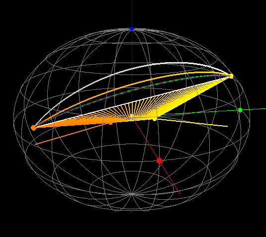

test-geoside
============

This repository contains 2 test programs for the purpose of testing spherical and geographical algorithms and strategies.

#### geoside.cpp

This program draws a grid of geographical points. Colors depends on the side of a point WRT geographical segment. The side is calculated using 2 methods:

1. spherical side formula transforming spherical coordinates into 3D cartesian vectors and checking the side using vector algebra.
2. comparison of azimuths calculated using Vincenty's inverse formula, azimuth1 of segment points SP1 and SP2, azimuth2 of SP1 and P.

The colors below indicates:
* gray - left
* yellow - right
* red - right on spheroid, left on sphere
* green - left on spheroid, right on sphere

Spheroid with flattening = 0.25

#### spheroid.cpp

This program is a 3D visualizer of a spheroid, two points with their longitudes and latitudes and curves on the surface representing a segment between those points. Curves are calculated using various methods.

Axes:
* X - red
* Y - green
* Z - blue

Points:
* p1 - orange
* p2 - yellow

Curves:
* test method - red
* mapping into sphere - green
* using geocentric coordinates - blue
* using vincenty formula - white
(green and blue overlaps)

Navigation:
* Left mouse button and move - yaw and pitch rotation
* Right mouse button and move - zoom
* ',' - decreese flattening
* '.' - increese flattening
* 'm' - switch test method

Spheroid with flattening = 0.25

