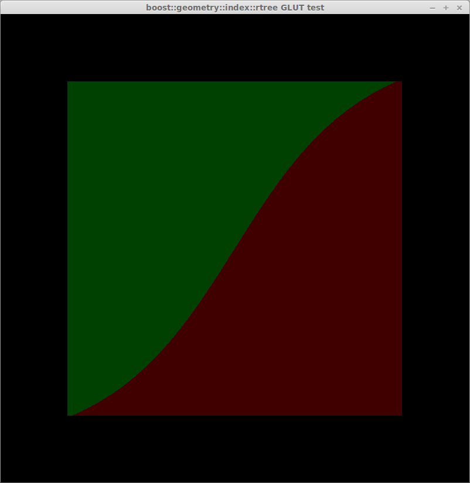
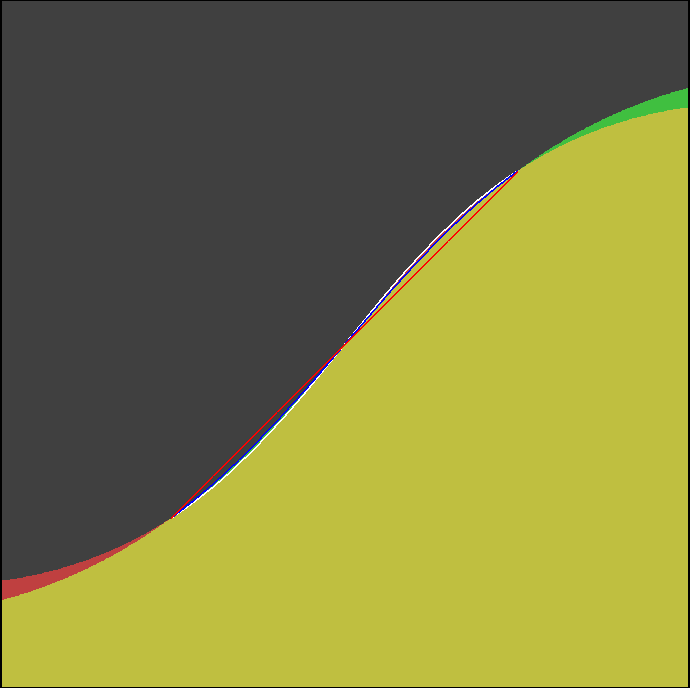
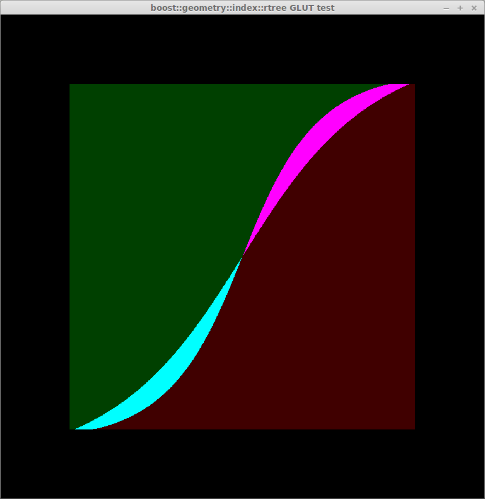

test-geoside
============

This program draws a grid of geographical points [-50,-50]x[50,50]. Colors depends on the side of a point WRT geographical segment (-51,-51)->(51,51). The side is calculated using 2 methods:

1. spherical side formula transforming spherical coordinates into 3D cartesian vectors and checking the side using vector algebra.
2. comparison of azimuths calculated using Vincenty's inverse formula, azimuth1 of segment points SP1 and SP2, azimuth2 of SP1 and P.

The colors below indicates:
* dark green - left
* dark red - right
* cyan - left on spheroid, right on sphere
* magenta - right on spheroid, left on sphere

Sphere or spheroid with flattening = 0

Spheroid with flattening = 1/300 (Earth)

Spheroid with flattening = 0.25

Spheroid with flattening = 0.5

